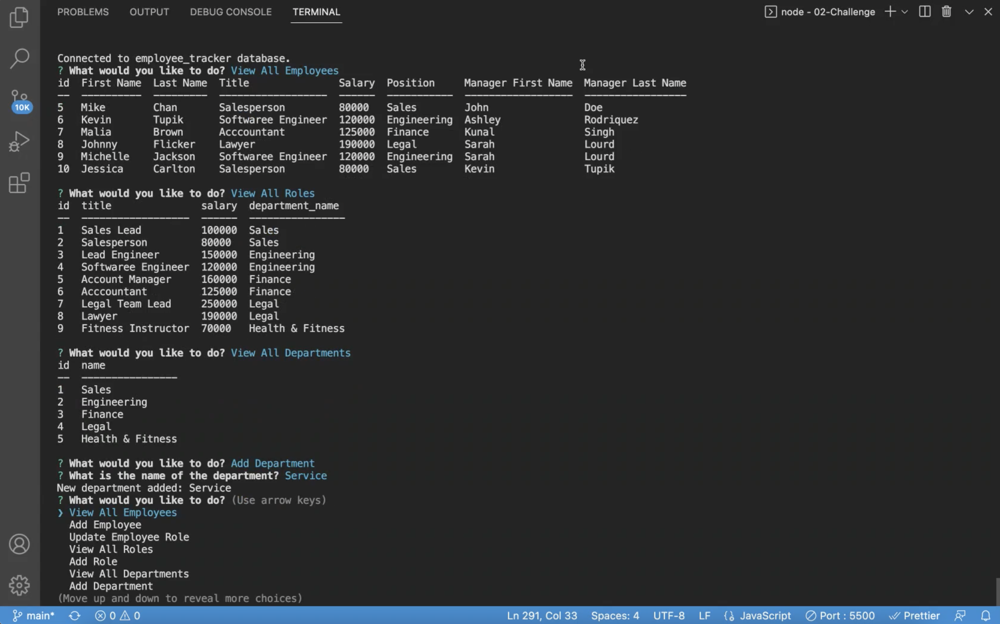

# Employee Tracker

## Description

This is a command-line application used to manage a company's employee database, using Node.js, Inquirer, and MySQL. This app will easily provide the ability to manage the departments, roles, and employees of a company in order to organize and plan around the business. 

## Installation
* To install the application, the user needs to install node.js and run `npm install` from the cloned repository.

## Usage

* This is a command-line application that accepts user input.
* To start the application, run  `npm start` in the terminal.
* The following options will then be presented: view all departments, view all roles, view all employees, add a department, add a role, add an employee, and update an employee role.
* When view all departments is selected, a formatted table showing department names and department ids is presented.
* When view all roles is selected,the job title, role id, the department that role belongs to, and the salary for that role is presented.
* When view all employees is selected, a formatted table showing employee data, including employee ids, first names, last names, job titles, departments, salaries, and managers that the employees report to is presented.
* When the user chooses to add a department, they will be prompted to enter the name of the department and that department is added to the database.
* Whene the user chooses to add a role, they will be prompted to enter the name, salary, and department for the role and that role is added to the database.
* When the user chooses to add an employee, they will be prompted to enter the employee’s first name, last name, role, and manager, and that employee is added to the database.
* When the user chooses to update an employee role, they are prompted to select an employee to update and their new role and this information is updated in the database.

## Mock-Up

Because this application won’t be deployed, you’ll also need to create a walkthrough video that demonstrates its functionality and all of the following acceptance criteria being met. You’ll need to submit a link to the video and add it to the README of your project.

The following image shows a mock-up of the application being used from the command line:

The following video shows an example of the application being used from the command line: 

Project repository: https://github.com/mich-hales/employee-tracker

